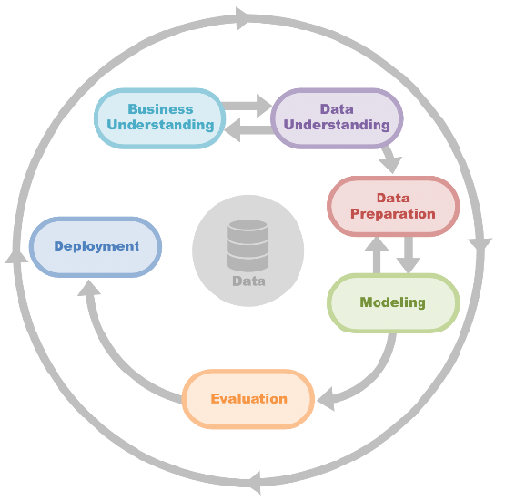
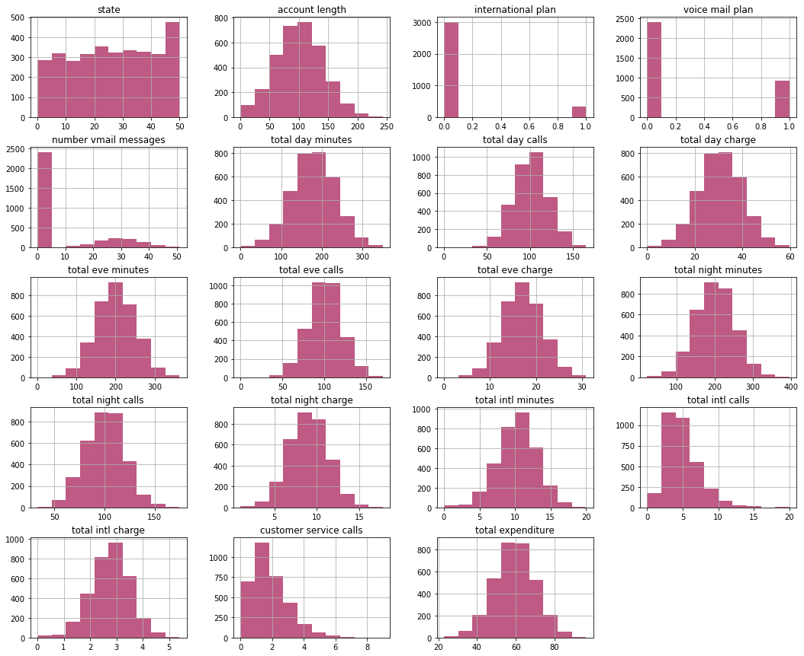
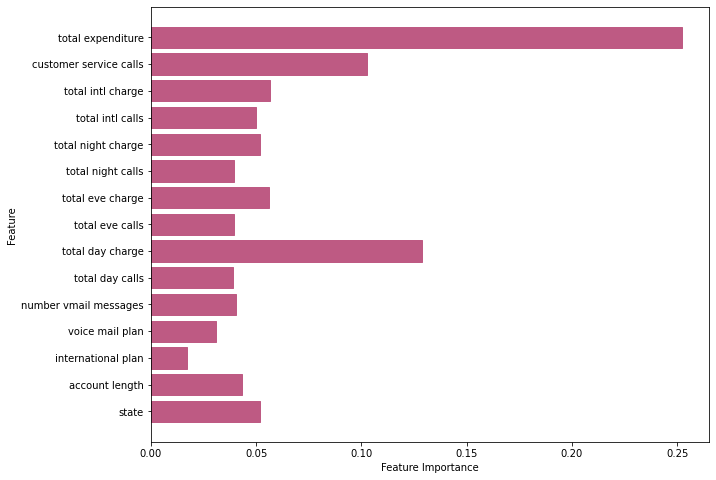

# <b> SYRIATEL CUSTOMER CHURN ANALYSIS </b>

### Author : Stella Kitur
#### [Blog Post][(https://stellacherotich.medium.com/)](https://stellacherotich.medium.com/b43e5b7ed136)
--- 
## <b> Project Overview </b>
The objective of this project was to develop a binary classification model to predict whether a customer of SyriaTel, a telecommunications company, is likely to stop doing business in the near future. The primary goal was to identify predictable patterns in customer behavior in order to help the company reduce financial losses associated with customer churn.
<b> Stakeholder </b>: SyriaTel

The Data Science Process that is adhered to in this analysis is the CRISP-DM Process that is illustrated in the image below. 

---
## <b> Business Understanding </b>

Customer churn has emerged as a critical concern for companies like SyriaTel in the fiercely competitive telecommunications industry. With customers having numerous options and increasing expectations, retaining existing customers has become paramount. 
Churn not only leads to immediate revenue loss but also exerts significant pressure on customer acquisition costs. Understanding the factors that contribute to churn and being able to predict it with accuracy is crucial for telecom businesses to develop effective retention strategies. By analyzing historical customer data, telecom companies can gain valuable insights into customer behavior, preferences, and interactions, enabling them to identify potential churners and tailor retention efforts accordingly and proactively.
This proactive approach minimizes revenue loss and enhances customer satisfaction, loyalty, and overall business performance.

### <b> Problem Statement </b>
SyriaTel would like to maintain/increase the customer retention rate as well as seeking to address the challenge of customer churn by developing an accurate binary classification model that predicts the likelihood of customers discontinuing their services.

### <b> Objectives </b>
The objective of this analysis is to:
1. Develop a highly accurate binary classification model that predicts customer churn for SyriaTel.
2. Identify predictable patterns and insights in customer behavior to proactively identify customers at a high risk of churning.
3. Enable SyriaTel to optimize retention strategies, allocate resources effectively, and minimize financial losses associated with customer churn.

### <b> Metrics of Success </b>
The model evaluations will involve comparing their performances based on the Recall (Sensitivity) metric.

The Recall score, represented as (TP/TP+FN), will be utilized for this comparison.

In the context of customer churn prediction, recall is preferred because it focuses on minimizing false negatives, ensuring that high-risk churn cases are <b>not missed. </b>

---
## <b> Data Understanding </b>
The SyriaTel Dataset was retrieved from [Kaggle](https://www.kaggle.com/datasets/becksddf/churn-in-telecoms-dataset).

The original dataset contains 3333 rows and 21 columns.

The columns included information that is associated with features of the customer information such as:

        state
        account length
        area code
        phone number  
        international plan
        voice mail plan 
        number vmail messages
        total day minutes 
        total day calls 
        total day charge 
        total eve minutes 
        total eve calls            
        total eve charge           
        total night minutes
        total night calls
        total night charge
        total intl minutes
        total intl call
        total intl charge
        customer service calls
        churn
        total expenditure

Below is an illustration of the distribution of features in the dataset.

---
## <b> Data Preparation </b>
As the data had no missing values or any duplicate values, the data instead was cleaned: this included dropping certain columns from the dataset, transforming the data, and preprocessing it so that it’d be suitable for the purpose of running the various models.

Other methods that were used in this stage included:

- Normalizing the dataset
- Data type conversions 
- Dealing with multicollinearity 
- Setting the target variables and splitting the train and test data.
---

## <b> Modeling </b>
In this stage, statistical and machine learning models are developed using the preprocessed data. Four (4) models were created:
1. Logistic regression model – Baseline model
2. Decision Tree Model.
3. Random Forest Model
4. Support Vector Machine

## <b> Model Evaluation </b>

In evaluating the model, the Random Forest Model was the best performing model, as it achieves a recall score of 74.77%. 
optimal parameters are determined to be {'rf__criterion': 'entropy', 'rf__max_depth': 18, 'rf__min_samples_leaf': 5, 'rf__min_samples_split': 3, 'rf__n_estimators': 400}.

These parameters are tuned to enhance the model's performance and achieve better results.

Additionally, the key features that were shown to influence whether a customer would churn or not can be seen in the bar plot displayed below. We can note that the total expenditure is a key predicting variable.

In the next section recommendations will be given based on this.

---
## <b> Recommendations </b>
Based on the model results, as the Data Scientist assigned to this project, I would recommend the following.

1. As <b> total expenditure </b> is an influencing factor for whether or not a customer will churn; 
    It is important that SyriaTel reconsiders some of the service costs, perhaps in a way that would be more accomodating to individuals that have a certain budget. 

2. Additionally, focus should be placed on the issues that are raised during the <b> customer service calls </b>, while also ensuring that those who are responding to the customers needs are adequately trained as well as adhering to good customer service norms, in order to ensure quality service is provided. 

3. Furthermore, SyriaTel should consider taking a customer-centered approach, for example having certain plans that can be modified to suit the needs of the diverse customer base, example: some customers may be more interested in the international plan compared to having a voice mail plan.

